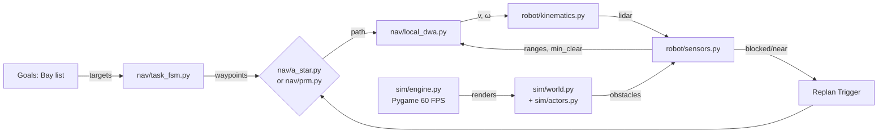

# Architecture

The system is built on Pygame for 2D simulation:

## Component Modules

- **sim/engine.py**: Pygame main loop (60 FPS), rendering layers, camera panning, pause/record toggles
- **sim/world.py**: Grid/tile map loader, occupancy grid, inflation computation
- **sim/actors.py**: Dynamic obstacle spawner with seeded RNG
- **robot/kinematics.py**: Diff-drive/unicycle model with speed limits
- **robot/sensors.py**: 2D LiDAR raycast, min-clearance monitor
- **nav/a_star.py**: Grid-based A* planner
- **nav/prm.py**: Sampling-based PRM planner
- **nav/local_dwa.py**: DWA-like local avoidance
- **nav/task_fsm.py**: Task executive with state machine
- **nav/maps.py**: Map utilities, shortest-path baseline
- **tools/logger.py**: CSV logging per run
- **tools/metrics.py**: KPI computation (efficiency, success, etc.)
- **tools/plots.py**: Matplotlib charts for comparison
